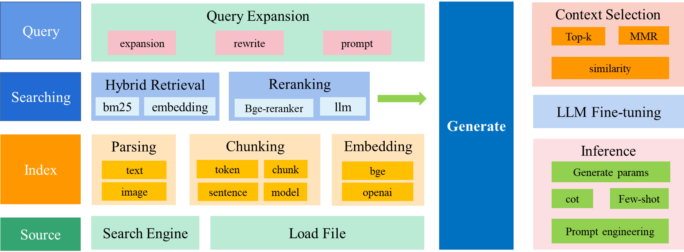

# Tiny RAG

## 1.简介

实现一个很小很小的RAG系统；

技术路线：

  - 将wiki、baike 特定的文本进行向量化后，存储在离线向量数据库中；
  - 在线检索离线数据库；
  - 将检索结果重排后，送到llm，构造prompt，llm输出结果

采用技术：



- 文档解析：支持 txt, markdown, pdf, word, ppt，图像等向量化
- 文档embedding：主要使用bge，同时有在线zhipu，openai embedding
- 图像embedding: 使用 clip-vit 进行图像embedding
- 句子切分：支持模型和规则切分
  - 模型切分： 采取的文档语义分割模型为 nlp_bert_document-segmentation_chinese-base， 论文见https://arxiv.org/abs/2107.09278
  - 规则切分
- llm：主要支持qwen2本地调用，同时支持市面api
- 向量数据库： 使用 faiss 向量数据库
- 召回：实现多路召回
  - 向量召回：将句子 bge 模型编码后，使用 faiss 数据库召回 top-n
  - bm25召回：使用 bm25 算法关键字召回
- 重排： 结合多路召回的结果，使用 bge-ranker 模型进行重排

## 2.项目文件简介

具体如下所示：

```shell
├─data                  # 存放原始数据和向量数据库文件夹
│  ├─db                 ## 缓存数据库文件 
│  │  ├─bm_corpus       ### bm25 召回缓存数据
│  │  └─faiss_idx       ### 向量召回缓存数据
│  ├─parser_test
│  └─raw_data           ## 原始数据
├─doc                   # 相关文档
├─models                # 模型存放文件夹
│  ├─bge-reranker-base
│  ├─bge-small-zh-v1.5
│  ├─clip-ViT-B-32
│  └─nlp_bert_document-segmentation_chinese-base
├─script                # 执行脚本文件
├─test                  # 测试文件
└─tinyrag               # tinyrag
    ├─embedding         ## embedding
    ├─llm               ## llm
    ├─parser            ## 文档解析
    └─searcher          ## 根据query搜索相关文档
       ├─bm25_recall    ### bm25召回
       ├─emb_recall     ### 向量召回
       └─reranker       ### 重排

```


一些效果：

```shell
prompt: 参考信息：
现居于北京市。
现居于北京市。
* 北京：北京
其总部设立于中国的首都北京。
两京并立，北京为首都，南京为留都。
平原上的主要城市有北京、天津、石家庄、雄安新区等，其中北京为现在中华人民共和国首都。
1987年，北京故宫（紫禁城）被登录为世界文化遗产。
---
我的问题或指令：
请介绍一下北京
---
我的回答：
北京是中国的首都，是一个历史悠久、文化多元的城市。这座城市拥有丰富的历史文化遗产和现代化的城市风貌，如故宫、天安门广场等。此外，北京还是中国科技产业发展的中心，拥有世界一流的科技公司。如果你喜欢历史文化，那么你可以去北京的南戴尔达高等科技园区。
---
请根据上述参考信息回答和我的问题或指令，修正我的回答。前面的参考信息和我的回答可能有用，也可能没用，你需要从我给出的参考信息中选出与我的问题最相关的那些，来为你修正的回答提供依据。回答一定要忠于原文，简洁但不丢信息，不要胡乱编造。我的问题或指令是什么语种，你就用什么语种回复。
你修正的回答:
output:  北京是中国的一座古代文明首都。它的建筑历史可以追溯到公元前4世纪。故宫是明清时期的中国皇宫。长城是世界著名的旅游景点之一，也是中国古代建筑的杰出代表。这些城墙的长度大约为40公里，建筑面积约为15万平方米。除此之外，中国还修建了众多宫殿和庙宇，以及其他著名的建筑，如故宫博物馆和颐和园等。
```

