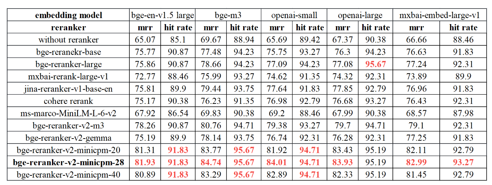

# ReRank vs Embedding&#x20;

> 本文摘自：[ReRank与Embedding模型的区别？ 如何选择ReRank模型？\_哔哩哔哩\_bilibili](https://www.bilibili.com/video/BV1r1421R77Y/?share_source=copy_web\&vd_source=a05b2192d4d66ba804ff90f2045d8916 "ReRank与Embedding模型的区别？ 如何选择ReRank模型？_哔哩哔哩_bilibili")

## 1.什么是 Rerank 模型？

ReRank模型是对RAG检索返回的结果进行重新排序的模型。 &#x20;

也就是下图中`2nd Retrieval`的模型，它的作用是对第一步RAG检索出来的chunks，也就是文本进行重新的排序的。 &#x20;

重新排序之后的文本，再给送给LLM来进行处理。

> 图1：QAnything处理流程图

## 2.为什么需要 Rerank 模型？

召回率与上下文窗口问题

- 文本Embedding向量存在信息丢失，影响检索准确率
- 大模型对长文本处理能力的限制

通过使用rerank模型来改善召回的同时，并让大模型产生更高质量的回答。

更多解释请访问：[https://techdiylife.github.io/blog/topic.html?category2=t07\&blogid=0048](https://techdiylife.github.io/blog/topic.html?category2=t07\&blogid=0048 "https://techdiylife.github.io/blog/topic.html?category2=t07\&blogid=0048")

## 3.为什么rerank模型比embedding模型排序结果好？

- Embedding处理时的信息的丢失，会影响检索的准确度
- Rerank模型直接通过模型来计算用户问题与文本的相似度，准确度会更高

更多解释请访问：[https://techdiylife.github.io/blog/topic.html?category2=t07\&blogid=0048](https://techdiylife.github.io/blog/topic.html?category2=t07\&blogid=0048 "https://techdiylife.github.io/blog/topic.html?category2=t07\&blogid=0048")

## 4.如何选择Rerank模型？

### 4.1 选择标准

- Huggingface最近一个月下载量
- QAnything实验对比结果

### 4.2 下载量（最近一个月）

**数据采集时间：2024.04.18**

| Model                                                                                                                                                                                                                                    | 下载量    |             |
| ---------------------------------------------------------------------------------------------------------------------------------------------------------------------------------------------------------------------------------------- | ------ | ----------- |
| [https://huggingface.co/BAAI/bge-reranker-large](https://huggingface.co/BAAI/bge-reranker-large "https://huggingface.co/BAAI/bge-reranker-large")                                                                                        | 340K   | 中，英         |
| [https://huggingface.co/BAAI/bge-reranker-base](https://huggingface.co/BAAI/bge-reranker-base "https://huggingface.co/BAAI/bge-reranker-base")                                                                                           | 346K   | 中，英         |
| [https://huggingface.co/hotchpotch/japanese-reranker-cross-encoder-xsmall-v1](https://huggingface.co/hotchpotch/japanese-reranker-cross-encoder-xsmall-v1 "https://huggingface.co/hotchpotch/japanese-reranker-cross-encoder-xsmall-v1") | 122K   | 日语          |
| [https://huggingface.co/BAAI/bge-reranker-v2-m3](https://huggingface.co/BAAI/bge-reranker-v2-m3 "https://huggingface.co/BAAI/bge-reranker-v2-m3")                                                                                        | 71K    | 多语言, 最新版    |
| [https://huggingface.co/mixedbread-ai/mxbai-rerank-large-v1](https://huggingface.co/mixedbread-ai/mxbai-rerank-large-v1 "https://huggingface.co/mixedbread-ai/mxbai-rerank-large-v1")                                                    | 32K 英语 |             |
| [https://huggingface.co/amberoad/bert-multilingual-passage-reranking-msmarco](https://huggingface.co/amberoad/bert-multilingual-passage-reranking-msmarco "https://huggingface.co/amberoad/bert-multilingual-passage-reranking-msmarco") | 22K    | 多语言         |
| [https://huggingface.co/mixedbread-ai/mxbai-rerank-base-v1](https://huggingface.co/mixedbread-ai/mxbai-rerank-base-v1 "https://huggingface.co/mixedbread-ai/mxbai-rerank-base-v1")                                                       | 16K    | 英语          |
| [https://huggingface.co/maidalun1020/bce-reranker-base\_v1](https://huggingface.co/maidalun1020/bce-reranker-base_v1 "https://huggingface.co/maidalun1020/bce-reranker-base_v1")                                                         | 15K    | 中文，英语，日语，韩语 |
| [https://huggingface.co/BAAI/bge-reranker-v2-minicpm-layerwise](https://huggingface.co/BAAI/bge-reranker-v2-minicpm-layerwise "https://huggingface.co/BAAI/bge-reranker-v2-minicpm-layerwise")                                           | 5K     | 多语言         |

### 4.3 QAnything的评估

**中文：**&#x20;

| Model                 | Reranking | AVG   |
| --------------------- | --------- | ----- |
| bce-reranker-base\_v1 | 66.31     | 66.31 |
| bge-reranker-large    | 66.01     | 66.01 |
| bge-reranker-base     | 63.87     | 63.87 |

**中英混合**

| Model                 | Reranking (12) | AVG (12) |
| --------------------- | -------------- | -------- |
| bce-reranker-base\_v1 | 61.29          | 61.29    |
| bge-reranker-large    | 60.86          | 60.86    |
| bge-reranker-base     | 59.04          | 59.04    |

参考链接：[https://github.com/netease-youdao/BCEmbedding/blob/master/Docs/EvaluationSummary/reranker\_eval\_summary.md](https://github.com/netease-youdao/BCEmbedding/blob/master/Docs/EvaluationSummary/reranker_eval_summary.md "https://github.com/netease-youdao/BCEmbedding/blob/master/Docs/EvaluationSummary/reranker_eval_summary.md")

### 4.4 BAAI推荐的最佳实践

**BAAI(北京智源人工智能研究院)推荐最佳实践：**&#x20;

- For multilingual, utilize BAAI/bge-reranker-v2-m3 and BAAI/bge-reranker-v2-gemma
- For Chinese or English, utilize BAAI/bge-reranker-v2-m3 and BAAI/bge-reranker-v2-minicpm-layerwise.
- For efficiency, utilize BAAI/bge-reranker-v2-m3 and the low layer of BAAI/ge-reranker-v2-minicpm-layerwise.
- For better performance, recommand BAAI/bge-reranker-v2-minicpm-layerwise and BAAI/bge-reranker-v2-gemma

[https://huggingface.co/BAAI/bge-reranker-v2-minicpm-layerwise](https://huggingface.co/BAAI/bge-reranker-v2-minicpm-layerwise "https://huggingface.co/BAAI/bge-reranker-v2-minicpm-layerwise")

### 4.5 模型推荐（中文，性能优先）

1. [https://huggingface.co/maidalun1020/bce-reranker-base\_v1](https://huggingface.co/maidalun1020/bce-reranker-base_v1 "https://huggingface.co/maidalun1020/bce-reranker-base_v1")
2. [https://huggingface.co/BAAI/bge-reranker-v2-minicpm-layerwise](https://huggingface.co/BAAI/bge-reranker-v2-minicpm-layerwise "https://huggingface.co/BAAI/bge-reranker-v2-minicpm-layerwise")
3. [https://huggingface.co/BAAI/bge-reranker-large](https://huggingface.co/BAAI/bge-reranker-large "https://huggingface.co/BAAI/bge-reranker-large")

**Rerank精度的评测指标：Hit-Rate，MRR（Mean Reciprocal Rank）**Hit-Rate 检索文本正解率（Top N 中）MRR 检索结果中正确文本所处位置的指标（越靠前分数越高）。

## 5.参考资料：

1. [https://www.llamaindex.ai/blog/boosting-rag-picking-the-best-embedding-reranker-models-42d079022e83](https://www.llamaindex.ai/blog/boosting-rag-picking-the-best-embedding-reranker-models-42d079022e83 "https://www.llamaindex.ai/blog/boosting-rag-picking-the-best-embedding-reranker-models-42d079022e83")
2. [https://github.com/FlagOpen/FlagEmbedding/tree/master](https://github.com/FlagOpen/FlagEmbedding/tree/master "https://github.com/FlagOpen/FlagEmbedding/tree/master")
3. [https://www.pinecone.io/learn/series/rag/rerankers/](https://www.pinecone.io/learn/series/rag/rerankers/ "https://www.pinecone.io/learn/series/rag/rerankers/")
